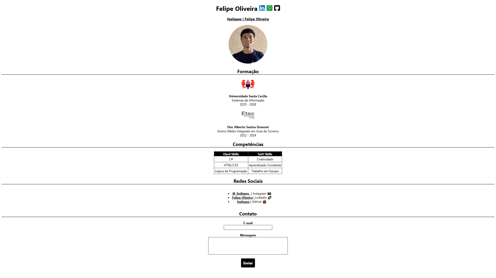

# 🎯 DESAFIO - Front End 
 
>Este repositório reúne meu primeiro projeto desenvolvido na faculdade, utilizando HTML e CSS. O objetivo é compartilhar minha evolução na área e servir como base para futuros estudos e aprendizados.

Olá, me chamo Felipe Oliveira e é com grande prazer que compartilho meu primeiro repositório aqui no GitHub!

Faço faculdade de **Sistemas de Informação** na Unisanta. Na última aula da disciplina Fundamentos de Desenvolvimento WEB, recebi o desafio de criar um site simples, contendo alguns tópicos como: 

- Formação 
- Competências
- Redes sociais 
- Contato 

O objetivo desse projeto é ser um **"currículo virtual"**, além de aplicar conceitos básicos de HTML e CSS para meus estudos. Vou explicar aqui no repositório, o que cada parte do código faz.

## Como vizualizar o projeto

Primeiramente se você quiser visualizar o projeto localmente, siga os passos a seguir:

1° Abra o Git Bash, e clone este repositório:
````
git clone https://github.com/feslispes/desafio-front-end.git
````
2° Acesse a pasta do projeto:
`desafio-front-end`

3° Abra o arquivo index.html no navegador de sua preferência.

## Explicação do Código

### ⭐ HTML

> Toda a estrutura do projeto foi feita em HTML, e armazenada dentro do arquivo [index.html](index.html).

<details>
<summary>Clique para ver a explicação do código HTML</summary>

 #### 🧩 Estrutura do Código
 ````html
 <!DOCTYPE html>
 <html lang="pt-br">
 ````
 Essa é a parte **inicial** do código, onde defino o documento como _HTML5_ e o idioma do site como português do Brasil.

#### 🌐 Cabeçalho (`<head>`)

```html
<head>
    <meta charset="UTF-8">
    <meta http-equiv="X-UA-Compatible" content="IE=edge">
    <meta name="viewport" content="width=device-width, initial-scale=1.0">
    <link rel="stylesheet" href="CSS/estilo.css">
    <title>feslispes | Felipe Oliveira</title>
</head>
```

Nessa parte do código, o cabeçalho:
- Garante que o site aceite caracteres acentuados.
- Configura o site para ser responsivo em dispositivos móveis.
- Importa a folha de estilos.
- Define o título da aba do navegador.

#### 🙋‍♂️ Apresentação Inicial

```html
<body>
    <h1>Felipe Oliveira
        <a href="[https://www.linkedin.com/in/felipe-oliveira-contato/](https://www.linkedin.com/in/felipe-oliveira-contato/)" target="_blank">
            
        </a>
        ...
    </h1>
```

Primeiramente, eu declaro o elemento `<body>` que representa o "corpo" do código. Logo após, o site irá mostrar meu nome e links clicáveis para o LinkedIn, WhatsApp e GitHub, com ícones.

#### 🎓 Formação

```html
<a href="[http://www.unisanta.br](http://www.unisanta.br)" target="_blank"></a>
<p>
    <b>Universidade Santa Cecília</b>
    <br>
    Sistemas de Informação
    <br>
    2025 - 2028
</p>
```

Agora apresento minha trajetória acadêmica, onde estou cursando o ensino superior e onde cursei o ensino médio. Cada formação possui um logo clicável e uma descrição.

#### 💪 Competências (Hard e Soft Skills)

```html
<table>
    <tr>
        <th>Hard Skills</th>
        <th>Soft Skills</th>
    </tr>
    ...
</table>
```

Utilizo uma tabela para organizar minhas habilidades, separando as técnicas das comportamentais por meio do elemento `<table>`.

#### 🌐 Redes Sociais

```html
<div class="container">
    <ul>
        <li>
            <a href="[https://www.instagram.com/_feslispes_/](https://www.instagram.com/_feslispes_/)" target="_blank">@_feslispes_</a> | Instagram 📸
        </li>
        ...
    </ul>
</div>
```

Criei uma lista com links diretos para minhas redes sociais. Você pode notar no código que utilizei a tag `<div>` para agrupar os elementos da lista, e será usada novamente mais pra frente.
Além disso, utilizei o elemento `<ul>` para estruturar a lista.

#### 📞 Contato

```html
<form method="post" action="[https://professores.unisanta.br/sobrino/scripts/mostra-v2.php](https://professores.unisanta.br/sobrino/scripts/mostra-v2.php)">
    <label for="email">E-mail</label>
    <input type="email" ... required>
    
    <label for="mensagem">Mensagem</label>
    <textarea ...></textarea>
    
    <div class="container"><button type="submit">Enviar</button></div>
</form>
```

Por último, adicionei um formulário que permite enviar mensagens via e-mail. Alguns pontos importantes dessa parte:
- O elemento `<form>` representa o formulário. O atributo `action` define para onde as informações preenchidas serão enviadas, no caso, um site usado apenas para teste, a 
fim de verificar se o envio está funcionando.

- O elemento `<button>`, que foi adicionado para o envio de dados. Se você notar, ele também carrega a tag `<div>`, que será usada para facilitar a formatação do site na folha de estilos.

</details>

### ⭐ CSS

> Toda a estilização do projeto foi feita em CSS, e armazenada dentro do arquivo [estilo.css](CSS/estilo.css).

<details>
<summary>Clique para ver a explicação do código CSS</summary>

#### 📄 Fonte e alinhamento

```css
body {
    font-family: -apple-system, BlinkMacSystemFont, 'Segoe UI', Roboto, Oxygen, Ubuntu, Cantarell, 'Open Sans', 'Helvetica Neue', sans-serif;
    font-size: 100%;
    text-align: center;
}
```

O `body` tem a função de definir uma família de fontes modernas e seguras, além de centralizar os textos.

#### 🙎‍♂️ Imagem de perfil

```css
#perfil-img {
    border-radius: 100%;
}
```

Adicionei o seletor `#perfil-img` e apliquei a propriedade `border-radius`, que deixa a imagem em formato circular.

#### 📚 Títulos

```css
h2 {
    border-bottom: 1px solid #000000;
}
```

Todos os títulos representados pela tag `<h2>` recebem uma linha inferior (`border-bottom`), e os títulos `<h3>` ganham sublinhado (`text-decoration: underline`).

#### 🌆 Tamanho de imagens

```css
.links-formacao {
    width: 80px;
}
```

A classe `.links-formacao` ajusta o tamanho dos logos para 80px (pixels) de largura.

#### 📌 Tabela

```css
table {
    border-collapse: collapse;
    display: inline-table;
}
...
```

Na tabela, adicionei a propriedade `border-collapse` para unir as bordas, cabeçalhos (`<th>`) com fundo preto e letras brancas, e células (`<td>`) centralizadas com espaçamento interno.

#### 📝 Formulário

> Foram aplicadas diversas estilizações ao formulário, então irei separá-las em tópicos.

```css
label, button {
    font-weight: bold;
    display: block;
}
```

Defini que tanto os textos dos elementos `label` quanto do `button` apareçam em negrito. Além disso, usei a propriedade `display: block` para que cada um ocupe toda a largura disponível, ficando organizados em linhas separadas.

```css
input, textarea {
    margin-bottom: 1rem;
    padding: 0.25rem;
    ...
}
#email {
    width: 15rem;
}
#mensagem {
    width: 25rem;
    ...
}
```

Aqui eu declaro que os elementos `input` e `textarea` tenham espaçamento, bordas arredondadas e tamanhos definidos (para `#email` e `#mensagem`, respectivamente).
````css
.container{
    display: flex;
    justify-content: center;
    align-items: center;
}
button{
    display: flex;
    background-color: #000;
...
button:hover{
    background-color: #555;
    border: solid #555;
}
````
O botão de envio possui fundo preto com texto branco, muda de cor ao passar o mouse e fica centralizado com o auxílio da classe `.container`.

#### 🔗 Links
````css
a{
    color: #000;
    font-weight: bold;
}
a:hover{
    color: #555;
}
````
Por último, os links aparecem em negrito e na cor preta, mudando para cinza no `hover`.

</details>

## 📘 Resultado Final:





## 🏆 Créditos

<p align="center">
Espero que você tenha curtido esse projeto, foi feito com muita dedicação e carinho :)
<br>Caso queira entrar em contato meu LinkedIn está logo abaixo ⬇<br><br>
  Desenvolvido por <b>Felipe Oliveira</b>
  <br><br>
  <a href="https://www.linkedin.com/in/felipe-oliveira-contato/">
    
  </a>
  <br><br>
  <bg>Vamos nos conectar!</bg>
</p>